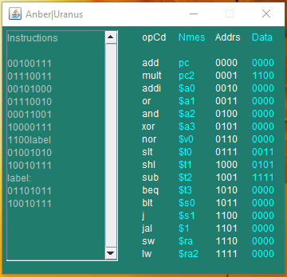

> Using uniprocessor; Following the Harvard architecture and RISC ISA
> design.16 registers are implemented (4-bits each).

<strong>Registers are distributed as the following:</strong>
<ul> <li>4 argument registers ($a0-$a3)</li><li>1 return value registers ($v0)</li>
<li>4 temporary registers ($t0-$t4)</li><li> 2 save value registers($s0-$s1)</li><li> 1 stack pointer($sp)</li><li> 1
One register ($one)($1)</li><li> 2 for return address($ra, $ra2)</li></ul>

<strong>available operations:</strong> 
<ol> <li>add</li><li>mult</li><li> addi</li><li> or</li><li> and</li><li> xor</li><li> nor</li><li> slt </li><li>shl </li><li>sub </li><li>beq </li><li>blt </li><li>j </li><li>jal </li><li>sw </li><li>lw</li></ol>

<code>using any text editor and similar syntax used for (mars for MIPS) will work accordingly.</code>

    //This is an example script for demo. to show syntax
    addi $t0 $t0 3 This adds 3 to register $t0
    addi $t1 $t0 2 add 1 from $t0 to value 5 and save it in $t1
    mult $t2 $t1 $t0 multiply 3 and 2 from the registers stated upwards
    j label
    and $t3 $t2 $t0
    
    label:
    nor $s0 $t2 $t0

<h6>Note:This simulation is following a datapath which is not incuded in this repo. .</h6>

Screenshot for the output:

